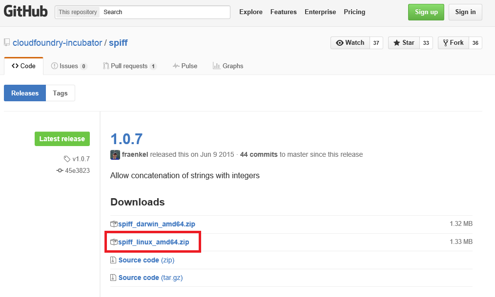
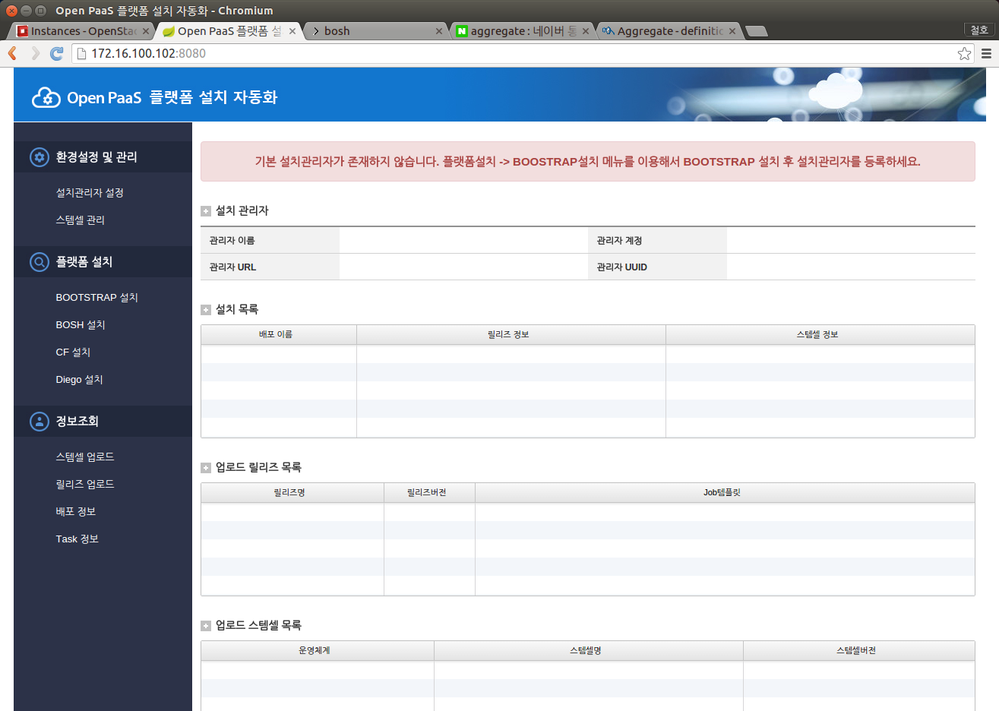

## Table of Contents
1. [문서 개요](#1--문서-개요)
     * [목적](#11--목적)
     * [범위](#12--범위)
     * [참고자료](#13--참고자료)
2. [플랫폼 설치 자동화 실행환경 구성](#2--플랫폼-설치-자동화-실행환경-구성)
     * [실행 환경을 위한 패키지 설치](#21--실행-환경을-위한-패키지-설치)
     * [Ruby 및 BOSH 의존 패키지 설치](#22--ruby-및-bosh-의존-패키지-설치)
     * [bosh-init 설치](#23--bosh-init-설치)
     * [bosh_cli 설치](#24--bosh\_cli-설치)
     * [spiff 설치](#25--spiff-설치)
     * [Java8 설치](#26--java8-설치)
     * [Maven 설치](#27--maven-설치)
     * [MySQL 설치](#28--mysql-설치)
3. [플랫폼 설치 자동화 메뉴얼](#3--플랫폼-설치-자동화-메뉴얼)
     * [플랫폼 설치 자동화 설치](#31--플랫폼-설치-자동화-설치)

#1.  문서 개요 

##1.1.  목적

본 문서는 플랫폼 설치 자동화 시스템의 설치를 위한 환경 구성 및 설치 절차에 대해 기술하였다.

##1.2.  범위

본 문서에서는 Linux 환경(Ubuntu 14.04)을 기준으로 플랫폼 설치 자동화의 설치하는 방법에 대해 작성되었고, 플랫폼 설치 자동화는 현재 Openstack과 AWS를 지원하고 있다.

##1.3.  참고자료

본 문서는 Cloud Foundry의 Document를 참고로 작성하였다.

BOSH Docoument: [http://bosh.io](http://bosh.io)

CF & Diego Document:
[http://docs.cloudfoundry.org/](http://docs.cloudfoundry.org/)

#2.  플랫폼 설치 자동화 실행환경 구성

##2.1.  실행 환경을 위한 패키지 설치 

플랫폼 설치 자동화는 BOSH CLI(command line interface) 실행환경을 웹으로 구현한 것으로 BOSH CLI와 유사한 구동 환경을 구성할 필요가 있다. 2장에서 설치한 가상머신에 실행환경을 구성한다. 환경 구성에 있어서 전제조건으로 가상머신은 외부와 통신이 가능해야 한다.

플랫폼 설치 자동화의 실행환경을 구성하기 위해 다음의 패키지 설치가
필요하다.

-   Ruby (1.9.3 이상)
-   bosh-init
-   bosh\_cli
-   spiff
-   Java8
-   maven
-   mysql

##2.2.  Ruby 및 BOSH 의존 패키지 설치 

BOSH CLI가 지원하는 Ruby버전 중 2.1.6버전을 설치 대상으로 기술하였고, 상세 설치 절차는 다음과 같다. 설치는 ubuntu(14.04)를 기준으로 설명하였다.

1.  BOSH 의존 패키지 설치

		$ sudo apt-get update
		$ sudo apt-get install -y build-essential zlibc zlib1g-dev ruby ruby-dev openssl libxslt-dev libxml2-dev libssl-dev libreadline6 libreadline6-dev libyaml-dev libsqlite3-dev sqlite3 libxslt1-dev libpq-dev libmysqlclient-dev

2.  git 설치

		# git 설치
		$ sudo apt-get -y install git

3.  Ruby 설치는 rbenv, rvm, source 컴파일 후 인스톨하는 3가지 방법이 있다. 본 문서에서는 rbenv를 이용하여 설치하는 방법으로 기술한다.

		$ cd
		$ git clone https://github.com/sstephenson/rbenv.git .rbenv
		$ echo 'export PATH="$HOME/.rbenv/bin:\$PATH"' >> ~/.bashrc
		$ echo 'eval "$(rbenv init -)"' >> ~/.bashrc
		$ exec $SHELL

		$ git clone https://github.com/sstephenson/ruby-build.git ~/.rbenv/plugins/ruby-build
		$ echo 'export PATH="$HOME/.rbenv/plugins/ruby-build/bin:$PATH"' >> ~/.bashrc
		$ exec $SHELL

		$ git clone https://github.com/sstephenson/rbenv-gem-rehash.git ~/.rbenv/plugins/rbenv-gem-rehash

		$ rbenv install 2.1.6
		$ rbenv global 2.1.6
 

4.	상기의 절차로 설치 후 아래의 명령어로 ruby 설치 버전을 확인한다.

  		$ ruby -v

##2.3.  bosh-init 설치

플랫폼 설치 자동화 서비스는 MicroBOSH를 bosh-init을 통해 배포한다. 따라서 bosh-init의 설치가 필요하다. bosh-init을 설치하는 절차는 다음과 같다.

1.  다음의 웹사이트에서 설치환경에 맞는 bosh-init 바이너리 파일을 다운로드한다.

	[https://bosh.io/docs/install-bosh-init.html](https://bosh.io/docs/install-bosh-init.html)

	

2.  다운로드 받은 bosh-init에 실행 권한을 부여하고 설치한다.

		# ~/Download 디렉토리에 파일을 다운로드 받았다고 가정
		$ chmod +x ~/Downloads/bosh-init-*
		$ sudo mv ~/Downloads/bosh-init-* /usr/local/bin/bosh-init

3.  Bosh-init 설치 확인

    	$ bosh-init -v

##2.4.  bosh_cli 설치

bosh\_cli는 클라우드 환경에 릴리즈, 배포, 라이프 사이클을 관리하는 BOSH와 연동하여 사용되는 커맨드라인 도구이다.

1.  bosh\_cli를 설치한다.

		$ gem install bosh_cli --no-ri --no-rdoc

2.  bosh 또는 bosh help명령어를 실행하면 사용가능한 CLI목록이 출력된다.

		$ bosh or bosh help

##2.5.  spiff 설치

spiff는 BOSH 배포 Manifest를 생성하기 위해 만들어진 커맨드 라인 도구이다.

1.  다음의 웹 사이트에서 설치 환경에 맞는 spiff 바이너리 파일을 다운로드한다.
  
	**웹 사이트: [https://github.com/cloudfoundry-incubator/spiff/releases](https://github.com/cloudfoundry-incubator/spiff/releases)**

	

2.  다운로드 받은 spiff를 설치한다.

		# unzip이 설치되어 있지 않은 경우
		$ sudo apt-get install unzip

		# ~/Download 디렉토리에 파일을 다운로드 받았다고 가정
		$ sudo unzip spiff_linux_amd64.zip -d /usr/local/bin/

3.  Spiff 명령어의 실행여부를 확인한다.

		$ spiff -v

##2.6.  Java8 설치

플랫폼 설치 자동화는 spring-boot기반의 java8로 개발되었기 때문에 java8 실행 환경을 설치하여야 한다.

1.  Java8 설치

		$ sudo add-apt-repository ppa:webupd8team/java
		$ sudo apt-get update
		$ sudo apt-get install oracle-java8-installer

2.  Java8 버전을 확인하다.

		$ java -version

##2.7.  Maven 설치

라이브러리 의존관계 관리 및 빌드 도구 Maven을 설치한다.

1.  Maven 설치

		$ sudo apt-get install maven

2.  Maven 실행여부를 확인한다.

		$ mvn -version

##2.8.  MySQL 설치

플랫폼 설치 자동화가 사용할 MySQL 데이터베이스를 설치한다.

1.  MySQL 설치

		$ sudo apt-get install mysql-server

2.  MySQL 설정 변경

		# 설정파일 변경
		$ sudo vi /etc/mysql/my.cnf

		...
		[mysqld]
		# * Basic Settings
		#
		user = mysql
		pid-file = /var/run/mysqld/mysqld.pid
		socket = /var/run/mysqld/mysqld.sock
		port = 3306
		basedir = /usr
		datadir = /var/lib/mysql
		tmpdir = /tmp
		lc-messages-dir = /usr/share/mysql
		skip-external-locking

		# 다음 설정 정보 추가 후 저장
		innodb_file_per_table
		innodb_file_format = Barracuda
		...

3.  MySQL 재시작

		$ sudo service mysql restart

4.  플랫폼 설치자동화가 사용할 Database를 생성한다.

		# Database 생성
		$ mysql -u root -p
		mysql> create database ieda;
		mysql> use ieda;

		^C

#3.  플랫폼 설치 자동화 메뉴얼

본 장에서는 플랫폼 설치 자동화를 설치하는 방법과 메뉴 구성 및 화면 설명에 대해서 기술하였다.

##3.1.  플랫폼 설치 자동화 설치

1.  플랫폼 설치 자동화(OPENPAAS-IEDA-WEB) 모듈을 다운로드 받는다.

	[다운로드](./../../Download_Page.md)
	
  |**구분**|**디렉토리**|**파일명**|**설명**|
  |-------|------------|---------------|------------------------------|
  | - |OpenPaaS-Env|OPENPAAS-IEDA-WEB.zip|플랫폼 설치 자동화 시스템|

2.  다운로드 받는 OPENPAAS-IEDA-WEB.zip 파일을 Home 디렉토리에 압축을 푼다.

		$ unzip OPENPAAS-IEDA-WEB.zip -d ~/

3.  플랫폼 설치 자동화 실행에 필요한 설정 파일을 생성하고, 다음과 같이 편집한다.

		$ cd OPENPAAS-IEDA-WEB

		# 설정 파일 생성 및 편집
		# 설정 템플릿 파일(OPENPAAS-IEDA-WEB/src/main/resource/application.properties)복사 후 편집

		$ cp src/main/resources/application.properties .
		$ vi application.properties

		# 서버 포트 설정
		server.port=8080

		# Database 설정
		spring.datasource.driverClassName=com.mysql.jdbc.Driver
		spring.datasource.url=jdbc:mysql://localhost/ieda?useUnicode=true&charaterEncoding=utf-8
		spring.datasource.username=root				## MySQL 계정
		spring.datasource.password=password			## MySQL 비밀번호
		spring.datasource.test-on-borrow=true
		spring.datasource.validationQuery=SELECT 1

		spring.jpa.database=MYSQL

		# 데이터베이스 테이블 스키마 설정(schema.sql)	## 설치환경에 맞게 스키마 경로를 수정
		spring.datasource.schema=/home/ubuntu/OPENPAAS-IEDA-WEB/src/main/resources/schema.sql

		# 초기 업로드 데이터 설정(data.sql)			## 설치환경에 맞게 설정파일 경로를 수정
		spring.datasource.data=/home/ubuntu/OPENPAAS-IEDA-WEB/src/main/resources/data.sql

		# 플랫폼 설치 자동화 구동시 필요한 테이블과 데이터 초기 로딩 및 관리를 위한 설정 
		# 최초 실행시 아래와 같이 설정하고 처리가 끝난 후 주석 처리한다.
		spring.datasource.initialize=true
		spring.jpa.hibernate.ddl-auto=create

		# 최초 실행한 다음 주석 제거하고 플랫폼 설치 자동화를 재구동한다.
		#spring.datasource.initialize=false
		#spring.jpa.hibernate.ddl-auto=update

		# JSP Views
		spring.view.prefix=/WEB-INF/views/
		spring.view.suffix=.jsp

		# multipart
		multipart.maxFileSize: 5000KB
		multipart.maxRequestSize: 5000KB
 

4.  플랫폼 설치 자동화를 실행한다.

		$ cd ~/OPENPAAS-IEDA-WEB
		$ mvn -Djava.security.egd=file:/dev/./urandom -Dspring.config.location=./application.properties package

		# 테이블 속성 수정
		$ mysql -u root -p
		mysql> use idea;
		mysql> alter table idea_diego_aws engine=innodb row_format=compressed key_block_size=8;
		mysql> alter table idea_diego_openstack engine=innodb row_format=compressed key_block_size=8;
		mysql> exit

		# mysql 데이터베이스 재시작
		$ sudo service mysql restart

		# 플랫폼 설치 자동화 실행
		$ java -jar -Djava.security.egd=file:/dev/./urandom -Dspring.config.location=./application.properties target/OPENPAAS-IEDA-WEB-1.0.0-SNAPSHOT.jar

5.  플랫폼 설치 자동화가 실행중인 계정에서 아래와 같이 설정 디렉토리가 생성되었는지 확인한다.

  
  |**설정 디렉토리**|                 **설명**|
|---------------------------------|---------------------------------------------|
  |{HOME}/.bosh\_plugin|              플랫폼 설치 자동화가 사용하는 기준 디렉토리|
  |{HOME}/.bosh\_plugin/stemcell|     스템셀 관리 디렉토리|
  |{HOME}/.bosh\_plugin/release|      릴리즈 관리 디렉토리|
  |{HOME}/.bosh\_plugin/deployment|   배포 관리 디렉토리|
  |{HOME}/.bosh\_plugin/temp|         임시 디렉토리|

6.  웹 브라우저를 이용해서 플랫폼 설치 자동화(http://[IP]:8080) 화면이 출력되면 플랫폼 설치 자동화의 설치가 완료된다.

	

##3.2.  플랫폼 설치 자동화 활용

플랫폼 설치 자동화 시스템의 사용법에 대해서는 다음의 다운로드 페이지에 있는 플랫폼 설치 자동화 설치 가이드 문서를 참조한다.

[사용 가이드](http://extdisk.hancom.com:8080/share.cgi?ssid=0GjSntB)
